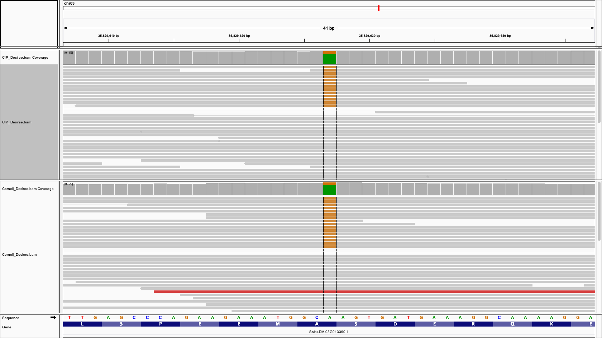
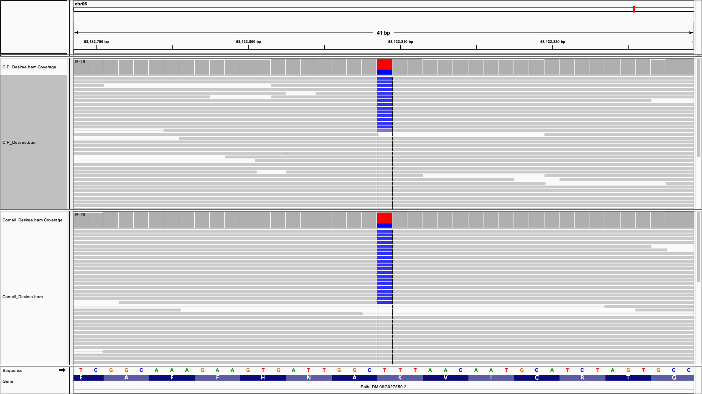
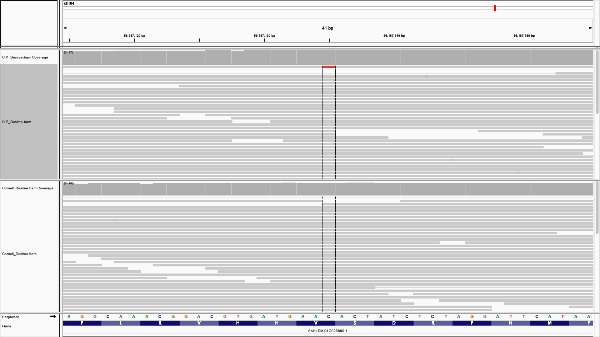
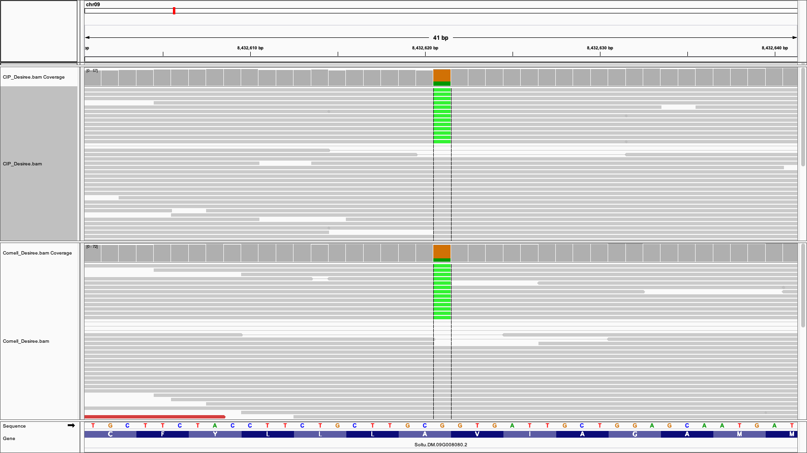

Aim: Build a phylogeny using array-genotyped European potato clones from [Sharma et al (2018) G3][1],
[Hirsch et al (2013) G3][2], sequencing data from [Hardigan et al (2017) PNAS][3], [Li et al (2018) Mol Plant][4],
and my resequencing of Desiree clones. Main question: Is USDA Desiree another clone represented in any of these panels?

## Packages:
```{r}
library(tidyverse)
library(viridis)
library(readxl)
library(ape)
library(phangorn)
```

## Functions:
```{r}
# extract all unique characters from a string, can be vectorized across a tibble column
uniqchars <- function(x) strsplit(x, "") %>% map(unique) %>% map(paste, collapse = "") %>% as_vector()

# separate a string of unique characters into columns. Fill NA from right
uniq_as_cols <- function(x) str_replace(x, "(^[A-Z])", "\\1:") %>% 
  separate(x, into=paste0("allele_", 1:2), remove = F, fill = "right") %>%
  mutate(solcap_allele_2 = ifelse(solcap_allele_2 == "", NA, solcap_allele_2)) 

sep <- function(...) {
  dots <- list(...)
  separate_(..., into = paste(dots[[2]], attributes, sep = "_"), convert = T, sep = ":")
}

rc <- function(mystr) {
  # print(mystr)
  tmp <- chartr("acgtACGT", "tgcaTGCA", mystr)
  # tmp <- str_replace_all(mystr, c("A" = "T", "T" = "A", "G" = "C", "C" = "G"))
  splits <- strsplit(tmp, "")[[1]]
  # print(splits)
  reversed <- rev(splits)
  # print(reversed)
  out <- paste(reversed, collapse = "")
  return(out)
}
```

## Explore Sharma et al (2018) dataset: SNP array genotypes of 351 clones, primarily of European origin
```{r}
euro_snp <- read_excel("~/Downloads/Table S10.xlsx", col_names = T, sheet = 1, na = "-9") %>% 
  mutate(study = "euro") %>% 
  select(study, Name, everything()) %>% 
  pivot_longer(-c(study, Name), names_to = "SNP", values_to = "genotype")
head(euro_snp)
```

> Note that genotypes are coded as A and B. Is DM1-3 in this panel?

```{r}
unique(euro_snp$Name)
```

> DM is not in the panel. Need to figure out the identities of alleles "A" and "B".
Maybe "A" is the reference allele? Check a few SNPs of sequenced CIP Desiree to get some idea.

```{r}
set.seed(77)
euro_snp %>% 
  filter(Name == "Desiree") %>% 
  filter(genotype != "AABB") %>% 
  sample_n(5)
```



> Here, euro allele A is the alternate allele and euro allele B is the reference allele



> Here, euro allele A is the alternate allele and euro allele b is the reference allele



> Here, A is the reference allele, B is the alternate allele.



> Here, A is the alternate allele, B is the reference allele.


> Here, A is the alternate allele, B is the reference allele.

> A and B seem to be arbitrary designations. How to determine which euro allele is A and which is B?
Look in the Hirsch dataset for redundant genotypes.

## Explore Hirsch et al (2013) G3 dataset: SNP array genotyeps of 250 clones, primarily of North American origin, but with few European and landrace clones.
```{r}
solcap_snp <- read_excel("TableS4.xlsx", col_names = T, skip = 1, na = ".") %>% 
  pivot_longer(-SNP, names_to = "Name", values_to = "genotype") %>% 
  mutate(study = "solcap") %>% 
  select(study, Name, everything())
head(solcap_snp)
```

Combine Sharma and Hirsch datasets:
```{r}
chip_snp <- euro_snp %>% 
  filter(SNP %in% solcap_snp$SNP) %>% 
  bind_rows(., solcap_snp) %>% 
  pivot_wider(names_from = SNP, values_from = genotype) %>% 
  arrange(Name)
head(chip_snp)
```

How many clones are replicated in both panels?
```{r}
duplicates <- names(which(table(chip_snp$Name) > 1))
duplicates
```
> Use simplex/triplex calls of these 16 clones to define alleles "A" and "B"

## Use genotype calls of redundant clones to define alleles "A" and "B" in the Sharma dataset:
```{r}
define_alleles <- chip_snp %>% 
  filter(Name %in% duplicates) %>% 
  pivot_longer(-c(study, Name), names_to = "SNP", values_to = "genotype") %>% 
  pivot_wider(names_from = study, values_from = genotype) %>% 
  mutate(n_euro_a = str_count(euro, "A"),
         n_euro_b = str_count(euro, "B")) %>% 
  mutate(solcap_alleles = uniqchars(solcap)) %>%
  separate(solcap_alleles, sep = 1, into = paste0("solcap_allele_", 1:2), remove = F, fill = "right") %>% 
  mutate(solcap_allele_2 = na_if(solcap_allele_2, "")) %>% 
  filter(n_euro_a != 2) %>% 
  mutate(n_solcap_allele_1 = str_count(solcap, solcap_allele_1),
         n_solcap_allele_2 = str_count(solcap, solcap_allele_2)) %>% 
  mutate(euro_allele_a = case_when(n_euro_a == n_solcap_allele_1 ~ solcap_allele_1,
                                   n_euro_a == n_solcap_allele_2 ~ solcap_allele_2)) %>% 
  mutate(euro_allele_b = case_when(n_euro_b == n_solcap_allele_1 ~ solcap_allele_1,
                                   n_euro_b == n_solcap_allele_2 ~ solcap_allele_2))
head(define_alleles)
length(unique(define_alleles$SNP))
```

> Here, each clone "votes" on the definition of alleles A and B.
Here, 3,343 SNPs could be scored in this way. Do the clones agree with each other?

```{r}
consensus_ab_definitions <- define_alleles %>%
  select(-Name) %>% 
  group_by(SNP, euro_allele_a, euro_allele_b) %>% 
  tally() %>% 
  filter(!is.na(euro_allele_a) & !is.na(euro_allele_b))
head(consensus_ab_definitions)
length(unique(consensus_ab_definitions$SNP))
```

> 3,221 SNPs remain.

```{r}
length(which(table(consensus_ab_definitions$SNP) == 1))
length(which(table(consensus_ab_definitions$SNP) > 1))
length(which(table(consensus_ab_definitions$SNP) > 1)) / length(which(table(consensus_ab_definitions$SNP) >= 1))
```

> 3,037 SNPs remain. ~6% of SNPs do not have a unanimous definition of "A" and "B".
To get an answer quickly, I'm going to run with the unanimous loci.
Even a single discordant call results in exlcusion, so it may be possible to
salvage more loci if needed. On the other hand, unanimous calls could be from
only one clone.

```{r}
unanimous <- names(which(table(consensus_ab_definitions$SNP) == 1))
```

```{r}
euro_recoded <- left_join(euro_snp, consensus_ab_definitions) %>% 
  filter(SNP %in% unanimous) %>%
  select(-n) %>% 
  mutate(Name = paste0(Name, "_euro")) %>% 
  pivot_wider(names_from = Name, values_from = genotype) %>%
  mutate(across(ends_with("euro"), tolower)) %>% 
  mutate(across(ends_with("euro"), function(x) str_replace_all(x, "a", euro_allele_a))) %>% 
  mutate(across(ends_with("euro"), function(x) str_replace_all(x, "b", euro_allele_b))) %>% 
  filter(!is.na(euro_allele_a))
head(euro_recoded)
```

> From here, make a distance matrix and a UPGMA tree using code from the SolCAP phylogeny scripts.
As a sanity check, compare results with this convertd matrix with the european matrix on its own.
Clusters should be the same.

## Combine SolCAP and euro panels:
```{r}
euro_for_join <- euro_recoded %>% 
  select(-study)
head(euro_for_join)

solcap_for_join <- solcap_snp %>% 
  rename(Sample = Name) %>% 
  mutate(Sample = paste0(Sample, "_", study)) %>% 
  pivot_wider(names_from = Sample, values_from = genotype) %>% 
  select(-study)
head(solcap_for_join)
```

```{r}
joined <- full_join(euro_for_join, solcap_for_join)
```

```{r}
joined_numeric_genos <- joined %>% 
  mutate(across(matches("_euro$|_solcap$"), function(x) str_count(x, euro_allele_a))) %>%
  pivot_longer(matches("_euro$|_solcap$"), names_to = "Sample", values_to = "genotype") %>%
  select(-euro_allele_a, -euro_allele_b) %>% 
  pivot_wider(names_from = SNP, values_from = genotype)
head(joined_numeric_genos)
```

```{r}
missing3 <- apply(joined_numeric_genos, 2, function(x) length(which(is.na(x))) / length(x))
missing_df3 <- tibble(snp = names(missing3),
                      perc_na = 100 * missing3)
ggplot(missing_df3, aes(x = perc_na)) + geom_histogram(binwidth = 1)
```

```{r}
imputed3 <- joined_numeric_genos %>% 
  select(-all_of(names(which(missing_df3$perc_na > 20)))) %>% # remove SNPs with > 20% missing data
  mutate(across(contains("snp"), function(x) replace_na(x, mean(x, na.rm = T)))) # impute missing data in the rest of the SNPs
head(imputed3)
```

Pairwise distances:
```{r}
dist_mtx3 <- imputed3 %>% 
  dplyr::select(-Sample) %>%
  dist(method = "euclidean") %>% 
  as.matrix()
rownames(dist_mtx3) <- imputed3$Sample
colnames(dist_mtx3) <- imputed3$Sample
```

UPGMA and NJ trees from distance matrices:
```{r}
UPGMA_tetra <- upgma(dist_mtx3)
nj_tetra <- NJ(dist_mtx3)
```

Write trees to disk:
```{r}
write.tree(UPGMA_tetra, file = "solcap_euro_combined_UPGMA_2021_0301.tre")
write.tree(nj_tetra, file = "solcap_euro_combined_NJ_2021_0301.tre")
```

> Are the duplicated samples next to each other?

| Clone            | Duplicates neighbors | Reason                        |
|------------------|----------------------|-------------------------------|
| Atlantic         | Yes                  |                               |
| Bintje           | Yes                  |                               |
| Chieftain        | Yes                  |                               |
| Dark Red Norland | Yes                  |                               |
| Defender         | Yes                  |                               |
| Kennebec         | Yes                  |                               |
| Ranger Russet    | Yes                  |                               |
| Red Pontiac      | Yes                  |                               |
| Russet Burbank   | Yes                  |                               |
| Russet Norkotah  | Yes                  |                               |
| Sierra Gold      | Yes                  |                               |
| Spunta           | Yes                  |                               |
| Stirling         | Yes                  |                               |
| Superior         | Yes                  |                               |
| Torridon         | Yes                  |                               |
| Umatilla Russet  | No                   | Looks like Vales Russet clone |

Note: Desiree has no close matches to SolCAP panel, is surrounded by european cultivars.

## What is Desiree? Combine sequence-based genotypes with chip-based genotypes and rerun the phylogeny:
```{r}
# get v6 coordinates of SNPs in the combined matrix
gff_cols <- c("seqid", "source", "type", "start", "end", "score", "strand", "phase", "gff_attributes")

solcap_v6_coords <- read_tsv("potato_array_SNPs_v6_liftover.gff3",
                             col_names = gff_cols,
                             comment = "#")
head(solcap_v6_coords)
```

```{r}
length(unique(euro_snp$SNP))
length(unique(solcap_snp$SNP))

left_join(solcap_snp, euro_snp, by = c("study", "Name", "SNP", "genotype")) %>% 
  group_by(SNP) %>% 
  tally() %>% 
  nrow()

solcap_snp %>% 
  filter(SNP %in% solcap_v6_coords$attributes) %>% 
  group_by(SNP) %>% 
  tally() %>% 
  nrow()

euro_snp %>% 
  filter(SNP %in% solcap_v6_coords$attributes) %>% 
  group_by(SNP) %>% 
  tally() %>% 
  nrow()

nrow(euro_recoded)

euro_recoded %>% 
  filter(SNP %in% solcap_v6_coords$attributes) %>% 
  nrow()

euro_recoded %>% 
  filter(SNP %in% solcap_v6_ext$id) %>% 
  nrow
```

> Summary of European panel SNPs:
  * 5,718 in the original dataset.
  * 4,455 could be anchored to v6.
  * 3,037 european panel SNPs could be recoded based on the SolCAP genotype calls. 
  * 2,387 recoded european SNPs could be anchored to v6 (required for intersection with sequence-based calls).
  * 2,032 recoded european SNPs could be anchored to v6 using Buell lab annotation.

> Summary of SolCAP panel SNPs:
  * 3,763 in the original dataset.
  * 3,763 could be anchored to v6.

Write out recoded SNPs to GFF file, then use to interesect sequence-based genotypes
```{r}
filter(solcap_v6_coords, attributes %in% euro_recoded$SNP) %>%
  arrange(seqid, start, end) %>% 
  write_tsv("solcap_v6_snp_for_euro_phylo.gff", col_names = F)
```

## Add individuals with sequence-based SNP calls to SNP matrix, then remake UPGMA tree:
```{r}
file <- "wb-split-calls-euro-phylo.vcf.gz"
vcf_header <- system(paste0("zgrep '^#C' ", file), intern = T) %>% 
  str_remove("^#") %>% 
  str_split(pattern = "\t") %>% 
  pluck(1)
vcf_header
```

```{r}
vcf <- read_tsv(file, comment = "#", col_names = c(vcf_header, gff_cols),  na = c(".", "./.", "././.", "./././.", "NA"))
```

```{r}
# not needed here
# info  <- str_split(vcf$INFO[1], ";")[[1]] %>% 
#   str_replace("=.+", "")
# info
```

```{r}
table(vcf$FORMAT)
```

```{r}
attributes <- str_split(names(table(vcf$FORMAT)), ":", simplify = F) %>% pluck(1)
attributes
```

```{r}
biallelic_series <- c("0/0/0/0", "0/0/0/1", "0/0/1/1", "0/1/1/1", "1/1/1/1",
                      "0|0|0|0", "0|0|0|1", "0|0|1|1", "0|1|1|1", "1|1|1|1")
```

```{r}
sample_vars <- colnames(vcf)[10:(ncol(vcf)-length(gff_cols))]
```

```{r}
vcf2 <- vcf %>% 
  # mutate(INFO = str_replace_all(INFO, "[A-Za-z]*=", "")) %>%
  # separate(INFO, into = info, sep = ";", convert = T) %>% 
  Reduce(f = sep, x = sample_vars)
```

```{r}
vcf3 <- vcf2 %>% 
  select(CHROM, POS, REF, ALT, all_of(gff_cols), everything(), -contains("KPT"),) %>% 
  filter(USDA_Desiree_GT %in% biallelic_series) 
```

```{r}
vcf4 <- vcf3 %>% 
  filter(CIP_Desiree_GT %in% biallelic_series) %>% 
  filter(Cornell_Desiree_GT %in% biallelic_series) %>% 
  filter(CNRS_Desiree_GT %in% biallelic_series) %>% 
  rename(SNP = gff_attributes)
nrow(vcf4)
```

join seq genotypes to chip genotypes before they're numeric
```{r}
chip_and_seq <- left_join(vcf4, joined, by="SNP")
```

reverse complement SNP chip calls if chip DM call doesn't match the VCF REF allele:
```{r}
rc_corrected <- chip_and_seq %>% 
  filter(str_length(REF) == 1) %>% 
  filter(str_length(ALT) == 1) %>% 
  distinct() %>% 
  mutate(revcomp_chip = !str_starts(`DM1-3 516 R44_solcap`, REF)) %>% 
  mutate(across(matches("_solcap$|_euro$"), function(x) ifelse(revcomp_chip, chartr("ACGT", "TGCA", x), x))) %>% # reverse only
  select(CHROM, POS, REF, ALT, SNP, revcomp_chip, everything())
```

numeric SNPs:
```{r}
numeric_genos <- rc_corrected %>% 
  mutate(across(ends_with("GT"), function(x) str_count(x, "0"))) %>% 
  mutate(across(matches("_solcap$|_euro$"), function(x) str_count(x, REF))) %>% 
  select(SNP, matches("GT$|solcap$|euro$")) %>% 
  pivot_longer(-SNP, names_to = "Sample", values_to = "geno") %>% 
  pivot_wider(names_from = SNP, values_from = geno)
```

impute missing data:
```{r}
imputed <- numeric_genos %>% 
  # select(-all_of(names(which(missing_df3$perc_na > 20)))) %>% # remove SNPs with > 20% missing data
  mutate(across(contains("snp"), function(x) replace_na(x, mean(x, na.rm = T)))) # impute missing data in the rest of the SNPs
dim(imputed)
```

```{r}
imputed %>% 
  filter(grepl("euro", Sample)) %>% 
  nrow
```

```{r}
dist_mtx <- imputed %>% 
  dplyr::select(-Sample) %>%
  dist(method = "euclidean") %>% 
  as.matrix()
rownames(dist_mtx) <- imputed$Sample
colnames(dist_mtx) <- imputed$Sample
```

UPGMA and NJ trees from distance matrices:
```{r}
UPGMA <- upgma(dist_mtx)
nj <- NJ(dist_mtx)
```

Write trees to disk:
```{r}
write.tree(UPGMA, file = "solcap_euro_seq_UPGMA_2021_0301.tre")
write.tree(nj, file = "solcap_euro_seq_NJ_2021_0301.tre")
```
## Follow up actions:
1. Email MSU to see whether Urgenta or Depesche are in their SNP database
2. Request genomic DNA of Urgenta or Depesche from European gemrplasm database
3. Request Depesche and/or Urgenta cuttings from Sturgeon Bay

[1]: https://academic.oup.com/g3journal/article/8/10/3185/6026984?login=true
[2]: https://www.g3journal.org/content/3/6/1003
[3]: https://www.pnas.org/content/114/46/E9999
[4]: https://www.cell.com/molecular-plant/fulltext/S1674-2052(18)30049-2?_returnURL=https%3A%2F%2Flinkinghub.elsevier.com%2Fretrieve%2Fpii%2FS1674205218300492%3Fshowall%3Dtrue